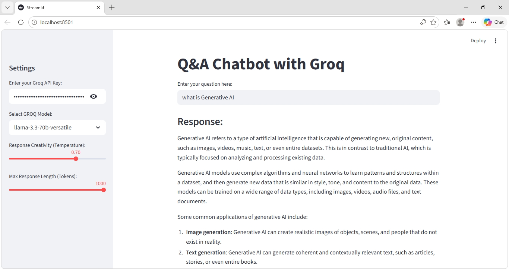

#  Q&A Chatbot with Groq + Streamlit

##  Overview

This project is a simple yet interactive Q&A chatbot powered by the **Groq API** and built using **Streamlit**.

It allows users to ask questions and receive fast, AI-generated responses using modern LLMs like LLaMA and GPT-based models.

---

##  Features

*  Interactive chat interface
*  Fast responses using Groq LLMs
*  Adjustable settings:

  * Model selection
  * Temperature (creativity)
  * Max tokens (response length)
*  Secure API key input from sidebar
*  Prompt-based response generation using LangChain

---

##  Tech Stack

* Python
* Streamlit
* LangChain (LCEL)
* Groq API
* python-dotenv
* LangSmith (for tracing & debugging)

---

##  Project Structure

```id="o8m1j2"
project/
│── app.py
│── requirements.txt
│── .env (optional)
```

---

##  Setup & Installation

### 1. Clone the repository

```bash id="w9q2xv"
git clone https://github.com/your-username/your-repo-name.git
cd your-repo-name
```

### 2. Install dependencies

```bash id="q3b8lm"
pip install -r requirements.txt
```

### 3. Run the app

```bash id="r7k2df"
streamlit run app.py
```

---

##  API Key Usage

You can enter your **Groq API Key directly in the sidebar** داخل التطبيق.

(Optional) You can also use a `.env` file:

```id="p4n8sj"
GROQ_API_KEY=your_api_key_here
```

---

##  How It Works

```id="y2v7kc"
User Input → Prompt Template → Groq LLM → Output Parser → Streamlit UI
```

The app uses **LangChain Expression Language (LCEL)** to build a simple pipeline:

* Prompt formatting
* Model invocation
* Output parsing

---

##  Available Models

* llama-3.1-8b-instant
* llama-3.3-70b-versatile
* openai/gpt-oss-120b

---

##  Observability (LangSmith)

Tracing is enabled using LangSmith for debugging and monitoring LLM calls.

---

##  Screenshots

()

---

##  Future Improvements

* Add conversation memory
* Implement RAG (document-based Q&A)
* Improve UI/UX
* Add streaming responses
* Add error handling for invalid API keys

---

##  Contributing

Contributions, suggestions, and improvements are welcome!

---

##  License

This project is licensed under the MIT License.
